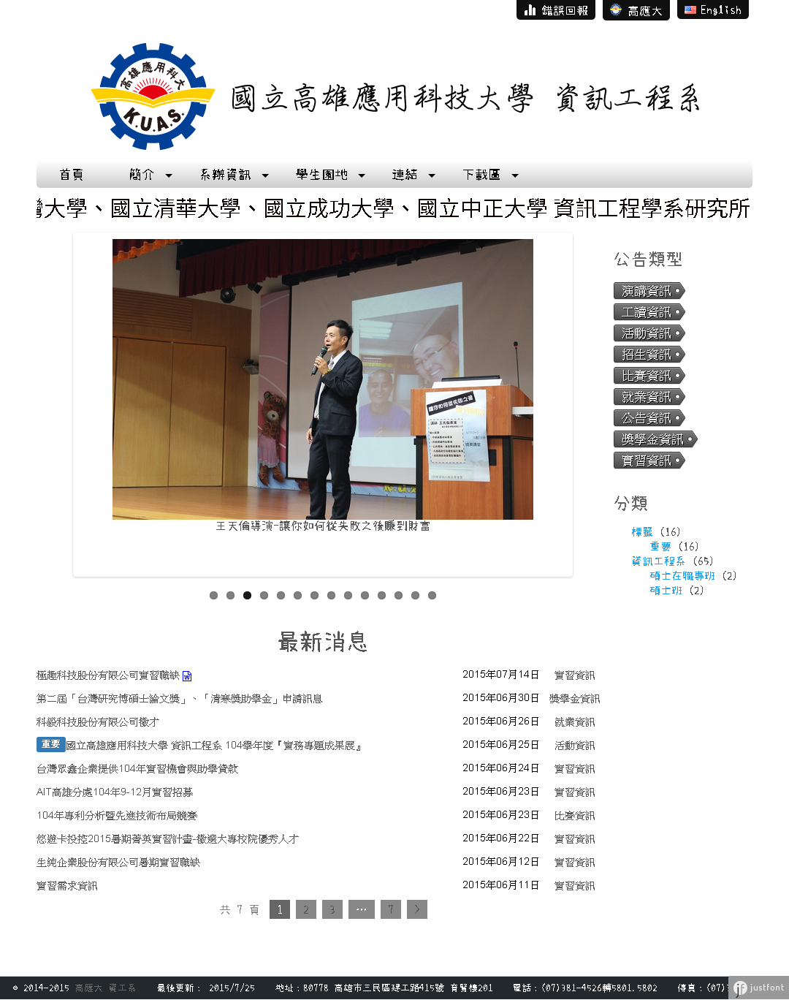

# KUAS_CSIE_Wordpress_Themes_TCC-Department

2015年高應大資工系系網使用WordPress製作，大約是從2014年11月開始研究的，一開始採用的是CodeIgniter，但是對於雙語支持，有些地方一直用不好，像是以文章的雙語支持，於是就找到了WordPress的Polylang感覺還蠻適合的拿來用的，一方面是我有點不太想自己寫後台，畢竟我還這麼嫩，不太可能防住大部分的攻擊。


## 版本記錄：

+ = 0.9 (2015-08-13) =
    - 改版內容：
        1.修正子頁面問題。
        2.修改主題選項結構，及後台主題選項成多欄位，並修正相對應的顯示程式。
        3.Ajax網址。
        4.右側選單移除，把標籤改到最新消息裡。
        5.文章附檔顯示，增加圖庫。
        6.修改載入中，顯示在網頁下方。
        7.頁面統整成一頁。
        8.修正FlexSlider位址。
        9.修正附檔顯示不完全。
        10.修正附檔導致排版歪掉。
        11.修正參數不完全，新聞無法顯示附件。
        12.修正顯示於標籤選單後的文章數量。
        13.新文章、即將過期通知。
    - 新增構想：
        1.主題設定匯出。
        2.選單匯出。
        3.前一篇與下一篇。
        4.附檔隱藏。
+ = 0.8 (2015-07-23) =
    - 改版內容：
        1.加入WP Attachments套件，支援附檔。
        2.加入justfont的字型。
        3.Flexslider圖片牆改成較彈性的HTML語法，而不是圖片網址引用圖片而已。
        4.修改Readme排版，待改版功能依重要性排序，並將之前想到的點子加入。
        5.將文章重導向目標改成下拉式選單。
        6.jQuery從1.11.2更新成2.1.4，目前沒發現不相容。
        7.預先加入Bug Tracker圖示。
        8.初步加入AngularJS。
        9.連結直接放在選單。
        10.最新消息使用Ajax處理。
        11.頁面也使用Ajax。
        12.將上傳檔案改成日期時間加流水號。
        13.先將回報做在Google表單。
        14.加入Awesome字型。
        15.標題顯示附檔。
        16.後台主題選項，改用表格當底。
    - 新增構想：
        1.初步加入LESS。
        2.使用者自訂樣式。
+ = 0.7 (2015-07-13) =
    - 改版內容：
        1.將標題連到學校首頁改成雙語的。
        2.將跑馬燈、圖片牆、頁尾資訊改成以語言分類。
        3.將跑馬燈、圖片牆、頁尾資訊後台設定畫面顯示功能合併成單一函式。
        4.修正Fifefox跑馬燈顯示不正常CSS語法。
        5.安裝Auto Thickbox來顯示文章中圖片。
    - 新增構想：
        1.Flexslider圖片牆功能增強，支援圖文。(O)
        2.新文章、即將過期通知。(O)
        3.回報系統。(Δ)
        4.Q&A。
+ = 0.6 (2015-07-10) =
    - 改版內容：
        1.開始始用Github紀錄。
        2.新增文章自訂參數(meta box)，分別是文章期限和文章重導向。
        3.首頁不顯示過期的公告。
        4.將標題隱藏，直接使用一張圖代替。
        5.採用Cool Tag Cloud。
        6.暫時不提供留言的功能。
    - 新增構想：
        1.更新英文內容。(Δ)
        2.跑馬燈、底部資訊資料庫分開。(Δ)

##待改版功能：

```
       重要性      便利性
    (★★★★★)(◆◆◆◆◇)Q&A。
    (★★★★☆)(◆◇◇◇◇)更新英文內容。
    (★★★★☆)(◆◆◆◇◇)AJAX更新。
    (★★★☆☆)(◆◆◆◇◇)新文章、即將過期通知。
    (★★★☆☆)(◆◆◆◇◇)熱門文章通知。
    (★★★☆☆)(◇◇◇◇◇)初步加入LESS。
    (★★★☆☆)(◇◇◇◇◇)初步加入AngularJS。
    (★☆☆☆☆)(◆◆◆◆◇)回到頂端。
    (★☆☆☆☆)(◆◇◇◇◇)使用者自訂樣式。
    (☆☆☆☆☆)(◇◇◇◇◇)簡體版。[目前暫無需求。]
    (          )(          )前一篇與下一篇
    (          )(          )整合相簿。
    (          )(          )討論版。[和Q&A部分重疊]
// (O)(Δ)(Χ)
// ☆★◇◆ＯＸ
```

## 選單：

```
    簡介Introduction
        沿革History
        位置Location
        師資Teachers
        特色Priorities
            實驗室Laboratory
            雙學制KUAS/CSUSB Articulation Plan
            核心能力Core Competence
            目標Goals
        課綱Lessons Gang
        未來Future
            就業Employment
            展望Outlook
    系辦公室Department Office
        歷任主管The list of Manager
        職員Staff
        課程Courses
        學術活動Academic Activities
        實習相關Fieldwork
    學生園地Student Corner
        系學會Student Association
        學生活動Student Activities
        網頁空間Web Service
    連結Link
        WebMail系統Web Mail
        校務系統Information Integration System
        電資學院Electrical Engineering and Computer Science(EECS)
            電子工程系Electronic Engineering(EC)
            電機工程系Electrical Engineering(EE)
            光電與通訊工程研究所Graduate Institute of Phonics and Communications(IPC)
        選課系統Course Selection System
        TA課輔與數位學習平台iLearning
        雲端教學與學習平台CLS
        分機查詢Extension Phone
    下載Download
        課程教材Textbook
        表單Forms
            大學部Bachelor's Degree
            碩士班Master's Degree
        規章辦法Rules
        課表Timetable
```

## 系辦聯絡訊息：

```
    地址：80778 高雄市三民區建工路415號 育賢樓201
    Adress: No.415, Jiangong Rd., Sanmin Dist., Kaohsiung City 807, Taiwan (R.O.C.)

    電話：(07)381-4526轉5801.5802
    Telephone: (07)381-4526#5801.5802

    傳真：(07)383-7424
    Fax: (07)383-7424

    電子郵件：wfoffice01@cc.kuas.edu.tw
    Email: wfoffice01@cc.kuas.edu.tw
```

## 影片

```
<div style=width:100%;>
    <video style=padding-left:40px; controls=controls autoplay width=640 height=480>
        <source src=video.mp4 type=video/mp4 />
        不支援video元件
    </video>
</div>
```

## 其他

```
網站標題：高應大 資工系
網站描述：國立高雄應用科技大學資訊工程系系網
主題：TCC-Department
外掛：
    Polylang 雙語功能
    TinyMCE Advanced 文字編輯
    Auto Thickbox 顯示文章中圖片
    WP Statistics 網站流量
    Cool Tag Cloud 顯示最新消息分類

    Crayon Syntax Highlighter 程式碼高亮顯示
    WordPress Importer 文章匯入
    WP-DBManager 資料庫備份
    WP Attachments 文章附件顯示
    Hyper Cache 降低伺服器負擔
    Attachments 支援附檔。
語言：
    zh_TW
```
